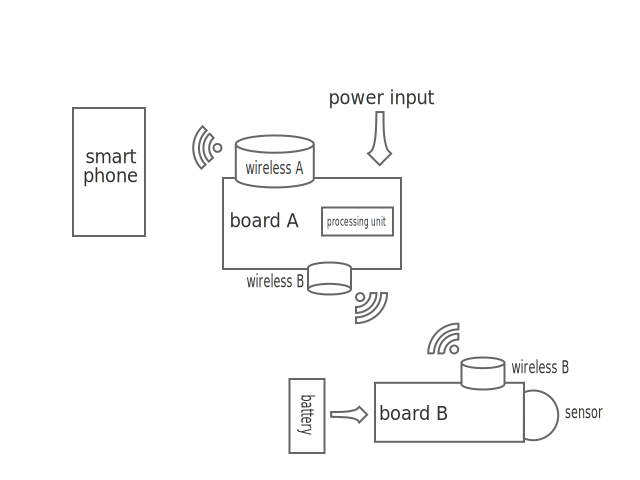

HumanConnectors
===============

The idea of human connector is to be able to crowd-connect remote devices by the use of a community. Each sensor or group of sensor is able to connect to a nearby smart-phone user and dump a little chunk of the data he wants to transmit. Then it is the smart-phone, via the 3G that pushes the data to the internet/server. The smart-phone must be equiped with an application where the user can enable the services he believes in.

### Why ?

Because this is the best way to put back human being in the middle of what is now called the connected world. Instead of just being particles that are monitored, citizens become enablers. If the service serves the common good or at least the good of a given community, then it can offers a free asynchronous connection (which is enough for most cases). If a service becomes crappy, it loses its community and thus it connection. 

Yes, there is deep belief in collective intelligence here.

### How ?

Lets take an example. A bunch of hackers calling themselves ANTS, designed a sensor that monitor the filling of bins in recycle centers. The reasons for that can be found [here](http://anthill.github.io/6element/presentation/).

#### 6element example: connecting remote recycling centers.

Here is the basic schema of how it works:

## Links

Arduino power consumption links
-------------------------------

[Run Arduino for years](http://www.openhomeautomation.net/arduino-battery/)

[Power saving techniques](http://www.gammon.com.au/forum/?id=11497)

[Solar module](http://www.voltaicsystems.com/solar-arduino-guide.shtml)
